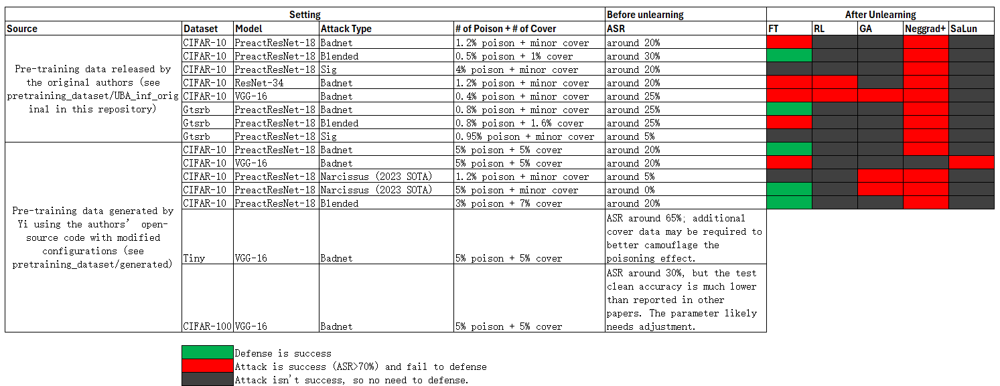

# Key Findings

  
*For raw data, see [findings_summary.xlsx](findings_summary.xlsx).*

### Observations

- In our experiments, only Fine-tuning and Neggrad+ consistently achieved successful attacks. Our proposed defense method is primarily effective against Fine-tuning-based unlearning attacks, but performs poorly against Neggrad+. Even under different parameter settings, the KL-based approach often exhibits label shift in Neggrad+, where the forget set predictions collapse either entirely to the poisoned target label or remain stuck at the ground-truth label.

- These attacks are highly sensitive to the amount of cover data, and both the dataset and attack type strongly influence the pretraining results. Extensive trial-and-error is often required to make the pretraining attack effective.

- We observed that under certain conditions (e.g., CIFAR-10, PARN-18, BadNet, 0.05 poison, 0.05 cover, learning rate=0.025, clip_num=1.5), the SaLun attack can also succeed. In such cases, our defense method was able to resist the attack. This suggests that our defense still has significant potential: with more confirmed cases of successful attacks, we may be able to demonstrate its effectiveness across a broader range of attack scenarios.
